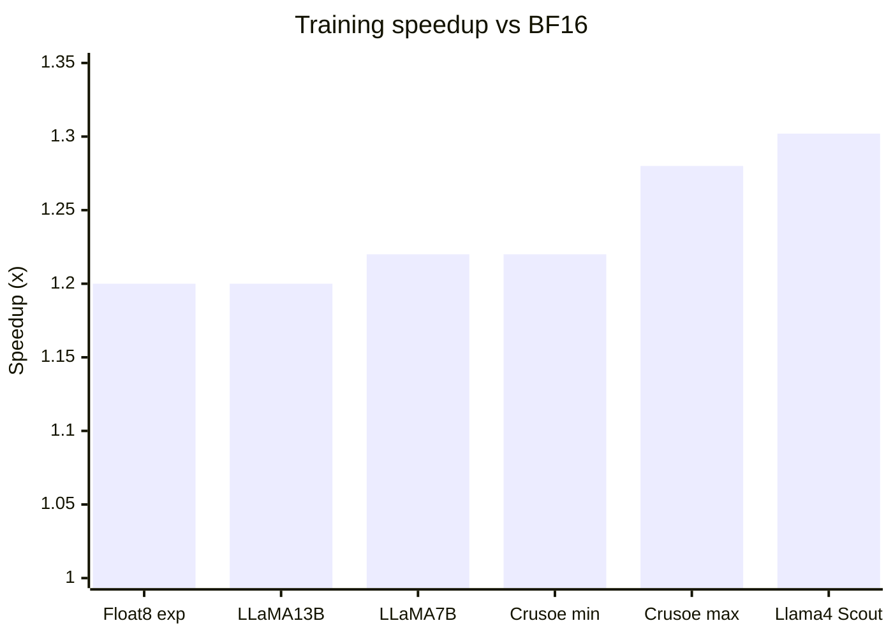

# 从 BF16 混合精度到 MXFP8：PPT 每页内容与演讲稿

面向对象：算法同事、训练框架同事。默认听众熟悉 FP16/BF16 混合精度训练，但不了解 FP8 / MXFP8。

用途：该文件给出每页 PPT 的可见内容、建议图示和演讲稿。可直接作为制作 PPT 的页面脚本。

---

## Slide 1. 从 BF16 混合精度到 MXFP8

**页面内容**

从 BF16 混合精度到 MXFP8

低精度训练的 scale 机制与 TE / MindSpeed 实现

**图示建议**

极简标题页。底部可放一条链路：

```text
BF16 mixed precision -> FP8 + scale -> MXFP8 block scale -> TE runtime -> MindSpeed/NPU
```

**演讲稿**

今天这次主要讲 MXFP8 在训练框架里的运行机制。大家已经熟悉 BF16/FP16 混合精度，所以 AMP 的基本概念不再展开，重点放在 FP8 以后新增的 scale、量化表示和低精 GEMM 执行链。

这条线会从 BF16 过渡到 FP8，先解释为什么单靠 FP8 编码不够，必须引入 scale；然后看普通 FP8 的 DelayedScaling，再看 MXFP8 为什么把 scale 细化到 32 个元素一组。最后再落到 TE 和 MindSpeed/NPU：框架到底怎样管理量化数据、scale、GEMM、缓存和通信。

---

## Slide 2. 开场：这不是新的 dtype，而是一套低精运行时

**页面内容**

FP8/MXFP8 的核心是一套低精运行时

- 不是全局 dtype 切换
- 不是所有 tensor 长期以 FP8 存储
- 不是 loss、optimizer、所有非 GEMM 算子都变成 FP8
- 重点是在模块内部管理量化数据和 scale 的生命周期

**图示建议**

左侧画“误解”：`model.to(FP8)` 被打叉。右侧画“真实路径”：`高精 tensor -> 量化表示 -> 低精 GEMM -> 高精输出 / 状态更新`。

**演讲稿**

先把边界讲清楚：这里讨论的 FP8/MXFP8，不是把模型整体做一次 `model.to(FP8)`，也不是让所有 tensor 长期以 FP8 保存。训练里很多状态仍然保持高精，低精主要发生在模块内部的关键 GEMM 路径。

BF16 比较容易接入，是因为它的指数范围接近 FP32；FP8 不一样，动态范围和有效精度都更紧，所以必须配合 scale、量化缓存和专门的低精 GEMM kernel。

所以这次真正要理解的是一套低精运行时：什么时候量化，scale 怎么产生和保存，低精 GEMM 消费什么表示，哪些结果能缓存复用，通信路径传的是高精 tensor 还是 data + scale。这些环节连起来，才是一条可训练的低精执行闭环。

---

## Slide 3. 为什么值得关注：收益来自核心 GEMM 主路径

**页面内容**

收益来自把主计算路径纳入低精执行

- `forward`: `y = x @ w^T`
- `dgrad`: `dx = dy @ w`
- `wgrad`: `dw = dy^T @ x`

主收益：

- 低精 GEMM 吞吐更高
- 参与 GEMM 的 activation / weight / gradient 位宽更低

端到端收益：

```text
低精 GEMM 和带宽收益 - 量化 / scale / 缓存 / 通信开销
```

**图示建议**

用一条横向流程展示三条 GEMM，并在下方用“收益项 - 抵消项 = 净收益”的简单公式。

**演讲稿**

先讲为什么值得关注。FP8/MXFP8 的收益不是来自“模型全局变成 8bit”，而是来自把训练里的核心 GEMM 主路径放到低精执行。以 Linear 为例，forward 是 `x @ w^T`，反向里还有 dgrad 和 wgrad，这三条都是 GEMM。

收益主要有两部分：第一，低精 GEMM 在硬件上的吞吐更高；第二，activation、weight、gradient 作为 GEMM 输入时位宽下降，关键路径上的访存压力也会下降。

但端到端收益不能按 dtype 位宽直接推。量化、scale 更新、缓存维护、通信同步都会吃掉一部分收益。后面讲每个机制时，可以一直带着这个公式看：收益来自低精 GEMM 和带宽，成本来自量化、scale、缓存和通信。

---

## Slide 4. 公开结果显示 1.2x-1.3x 量级收益

**页面内容**

公开结果用于建立量级预期



边界：

- 这些是 PyTorch / TorchAO / TorchTitan 生态公开结果
- 可作为 FP8/MXFP8 训练收益旁证
- 不是 TE 官方 benchmark，也不能直接外推

**图示建议**

柱状图。右侧放边界说明：`生态侧公开结果；硬件、模型、并行策略不同，不能直接外推。`

**演讲稿**

这里先用公开结果建立一个量级感。Float8 in PyTorch 的早期实验里，小规模训练可以到 up to 1.2x；LLaMA 7B 单卡和 LLaMA 13B 多卡也在 1.20x 到 1.22x 这个区间。

TorchAO + TorchTitan 的 MXFP8 结果更贴近今天的主题。Crusoe B200 上 Llama3-70B 预训练公开结果是 1.22x 到 1.28x；Llama4 Scout 在 GB200 上的 MoE 训练结果是 30.2% speedup，约等于 1.3x。

这组数据只用来建立预期，不当作我们环境里的承诺。它来自 PyTorch / TorchAO / TorchTitan 生态公开资料，不是 TE 官方 benchmark，也不能直接外推到我们的模型、硬件和并行策略。可以确定的是，FP8/MXFP8 已经在公开训练系统里跑出了端到端收益，后面要看的是机制和落地条件。

---

## Slide 5. FP8 表示范围更紧，因此必须引入 scale

**页面内容**

FP8 比 BF16 更依赖缩放

| 格式 | 近似可表示范围 | 关键含义 |
| --- | --- | --- |
| BF16 | 最大有限值约 `3.39e38` | 动态范围接近 FP32 |
| E4M3 | 约 `±448` | 精度较高，范围小 |
| E5M2 | 约 `±57,344` | 范围较大，精度低 |

结论：

```text
单靠 FP8 编码难以承接训练数值分布；
因此需要引入新的机制：scale，
将真实值按比例映射到 FP8 可表示范围。
```

注：右侧范围图只表达数量级关系，不按线性比例绘制。

**图示建议**

用对数轴或明确标注“不按比例”的范围示意图表示 BF16 覆盖范围远大于 E4M3/E5M2。E4M3 和 E5M2 可用两个短区间表示，一个偏“精度”，一个偏“范围”。

**演讲稿**

接下来从 BF16 过渡到 FP8。BF16 保留了 8bit exponent，所以动态范围接近 FP32，这也是很多 BF16 混合精度路径能比较自然接入的原因。

FP8 的情况不同。E4M3 的范围大约是正负 448，E5M2 的范围大约是正负 57344。E4M3 尾数位更多，精度相对高一些，但范围小；E5M2 范围更大，但有效精度更低。

从这组范围可以看到，单靠 FP8 编码很难直接承接训练中 input、activation、weight、gradient 的数值分布，所以必须引入新的机制：scale，把真实值按比例压到 FP8 可表示范围内。

更准确地说，FP8 格式规定的是编码空间，包括指数位、尾数位、最大有限值和可表示间隔；scale 负责建立真实训练值到这个编码空间之间的比例关系。后面所有 FP8/MXFP8 机制，基本都围绕这件事展开。

---

## Slide 6. FP8 表示：数据 + scale

**页面内容**

FP8 表示不是裸 dtype

```text
q = cast_to_fp8(x * scale)
```

低精路径需要同时管理：

- 量化后的 FP8 data
- 对应的 scale / scale_inv
- 能解释这组表示的 GEMM kernel

**图示建议**

画一个输入 tensor 到量化表示的转换：

```text
BF16/FP16 tensor -> scale -> FP8 data + scale_inv -> GEMM
```

**演讲稿**

有了 scale 之后，FP8 训练里的基本对象就不是一个裸 FP8 tensor，而是一组量化表示：FP8 data 加上对应的 scale 或 scale_inv。

可以用这个近似式理解：先用 scale 调整输入的数值范围，再 cast 成 FP8。后续 GEMM kernel 不能只看 data，它还需要知道这批 data 对应的缩放关系，否则就没法恢复正确的数值语义。

这个认识很重要。后面讲 DelayedScaling、MXFP8、rowwise 和 columnwise，本质上都是在回答同一组问题：scale 从哪里来，粒度多细，怎么和 data 绑定，又由哪个 GEMM kernel 消费。

---

## Slide 7. FP8 数据消费：低精 GEMM 消费量化表示

**页面内容**

FP8 表示进入低精 GEMM

```text
高精 tensor
  -> 量化数据 + scale
  -> 低精 GEMM kernel
  -> 高精输出 / 后续状态更新
```

Linear 训练中的三条 GEMM：

```text
forward: y  = x @ w^T
dgrad:   dx = dy @ w
wgrad:   dw = dy^T @ x
```

**图示建议**

上半部分画 `高精 tensor -> 量化表示 -> GEMM -> 高精输出`。下半部分用三行列出 forward / dgrad / wgrad。

**演讲稿**

理解了 FP8 表示之后，再看它主要被谁消费。FP8 量化表示主要服务低精 GEMM kernel，不是为了让所有算子都变成 FP8。

这条路径可以概括为：高精 tensor 先转成量化数据和 scale，低精 GEMM kernel 消费这组表示，输出再回到高精语义，继续交给后面的 loss、backward 或 optimizer。

后面固定用 Linear 作为例子。forward 是 `x @ w^T`，反向里有 dgrad 和 wgrad。TE runtime、MXFP8 的 rowwise/columnwise、缓存复用，都会落回这三条 GEMM 来解释。

---

## Slide 8. Linear 最小闭环：量化 -> GEMM -> scale 更新

**页面内容**

Linear 低精路径中的 DelayedScaling 闭环

```text
本轮量化：使用已有 scale
本轮执行：FP8 GEMM
本轮记录：新的 amax
收尾更新：下一轮使用的 scale
```

一句话：

```text
本轮用旧 scale，本轮记录新 amax，统一更新后给下一轮用。
```

**图示建议**

环形流程图：

```text
scale_n -> quantize -> GEMM -> amax_n -> update -> scale_{n+1}
```

**演讲稿**

进入普通 FP8 后，先看一个最小闭环。DelayedScaling 的核心不是“本轮算出 scale 本轮马上用”，而是本轮先用已有 scale 完成量化和 GEMM，同时记录新的 amax。

流程可以按图上这条环来讲：`scale_n` 进入 quantize，GEMM 执行时记录 `amax_n`，收尾阶段根据 amax 更新出下一轮要用的 scale。也就是本轮用旧 scale，本轮记录新 amax，统一更新后给下一轮用。

这样做的好处是 scale 更新更稳定，也方便 runtime 批量管理每个模块的 amax、history 和 scale 状态。下一页把这几个状态拆开讲清楚。

---

## Slide 9. DelayedScaling 状态：amax / scale / history

**页面内容**

DelayedScaling 的三个状态概念

| 概念 | 作用 |
| --- | --- |
| `amax` | 本轮观测到的最大绝对值 |
| `scale` | 下一次量化真正使用的缩放因子 |
| `amax_history` | 平滑历史窗口，降低单次异常值影响 |

**图示建议**

用三段式图：

```text
observe amax -> update history -> compute next scale
```

**演讲稿**

DelayedScaling 里最容易混在一起的是这三个概念。`amax` 是观测值，表示本轮看到的最大绝对值；`scale` 是下一次量化真正使用的控制量；`amax_history` 是历史窗口，用来避免一次异常值把 scale 拉得过猛。

DelayedScaling 的“delayed”就在这里：本轮先观测，观测结果延后影响后续量化使用的 scale。它牺牲一点即时性，换来更稳定的 scale 更新。

从框架角度看，这些状态不是临时局部变量，而是模块生命周期里的运行时状态。TE 需要 recipe state，本质上就是为了保存和更新这些量。

---

## Slide 10. 普通 FP8 的局限：scale 粒度与状态成本

**页面内容**

per-tensor scale 的主要问题

- 一个 scale 覆盖的数值范围较宽
- 同一 tensor 内分布不均时，小值更容易损失
- scale / amax 管理带来运行时状态
- 分布式场景下可能引入 amax 同步

过渡：

```text
MXFP8 的核心变化：把 scale 粒度进一步切细。
```

**图示建议**

左侧画一个 tensor 共用一个 scale；右侧预告分成多个 32 元素 block。

**演讲稿**

普通 FP8 的主要限制来自 scale 粒度。如果一个 tensor 或较大范围共用一个 scale，而内部数值分布差异很大，scale 往往要照顾大值，小值就更容易损失有效精度。

另外，scale 和 amax 的维护本身也有成本。单机里是状态管理和更新开销；分布式场景里，如果多个 rank 的分片要作为同一个逻辑 tensor 进入低精 kernel，还可能需要同步 amax。

这就引出 MXFP8：它不取消 scale，而是把 scale 粒度进一步切细，让每个 scale 覆盖更窄的数值范围。

---

## Slide 11. MXFP8 = FP8 data + E8M0 microscale

**页面内容**

MXFP8 的表示

```text
MXFP8 = FP8 data + E8M0 microscale
```

核心规则：

- 连续 `32` 个元素共享一个 scale
- scale 使用 `E8M0`
- scale 是 block 级，不是 tensor 级

**图示建议**

画一个向量，被切成多个长度为 32 的 block，每个 block 上方有一个 `E8M0 scale`。

**演讲稿**

MXFP8 的核心是 microscaling。可以先记住这个定义：MXFP8 等于 FP8 data 加 E8M0 microscale。

它把 scale 粒度从 tensor 级或较粗粒度，细化到连续 32 个元素一组。每个 32 元素 block 共享一个 E8M0 scale，E8M0 可以理解为 power-of-two microscale。

所以 MXFP8 仍然是 data + scale，只是 scale 不再是整个 tensor 一份，而是 block 级一份。这个变化能让每个 scale 覆盖的数值范围更窄，降低 tensor 内部分布不均带来的量化误差。

---

## Slide 12. 块级 scale 的价值：误差、状态和约束

**页面内容**

MXFP8 带来的变化

算法侧：

- 每个 scale 覆盖的值域更窄
- 局部分布差异更容易被适配
- 量化误差更可控

框架侧：

- scale 粒度从 tensor 级细化到 block 级
- data 必须按对应 block scale 解释
- kernel、缓存、通信都要维护 data-block scale 配对
- shape 和 shard 边界要满足 block 对齐

**图示建议**

两列布局：左侧“算法侧”，右侧“框架侧”。中间放 `32-element block scale`。

**演讲稿**

这页从两个视角看 MXFP8。对算法同事来说，价值在于 scale 粒度变细。每个 scale 覆盖的值域更窄，对 activation、weight、gradient 的局部分布差异更友好，量化误差更可控。

对框架同事来说，变化集中在表示复杂度上。scale 被细化到 32 元素 block 后，每段 FP8 data 都必须按对应的 block scale 解释，data 和 scale 的绑定关系变得更强。

因此 GEMM kernel、缓存复用、通信路径都要维护 data 和 block scale 的配对关系。scale 不再只是一个 tensor 级元数据，而是更细粒度的运行时表示。

还有一个工程约束：block 是 32 个连续元素，shape 和并行切分边界如果破坏 32 对齐，就可能影响能否保持原生 MXFP8 表示。

---

## Slide 13. MXFP8 的 32 元素 block 在矩阵里有方向

**页面内容**

MXFP8 block 是一维的

```text
rowwise:    沿行方向，每 32 个连续元素共享 scale
columnwise: 沿列方向，每 32 个连续元素共享 scale
```

关键点：

```text
不是一个 2D tile 共享一个 scale
rowwise / columnwise 是不同方向上的 data + scale 配对
```

**图示建议**

两张矩阵图：左侧用横向高亮标出 rowwise 32 元素 segment，右侧用纵向高亮标出 columnwise 32 元素 segment。矩阵格子可用省略号表示示意，不要让人误解为只有 8 个元素。

**演讲稿**

这里要特别讲清楚 block 的方向。MXFP8 的 block 是一维连续 32 个元素，不是一个二维 tile 共用一个 scale。

同样的规则放到二维矩阵里，就必须选择连续 32 个元素沿哪个方向取。沿行方向分组，就是 rowwise；沿列方向分组，就是 columnwise。

这个区别不是命名差异，而是不同的 data + scale 配对关系。后续 GEMM 对输入矩阵的消费方向不同，所以 MXFP8 tensor 往往要准备 rowwise 和 columnwise 两种表示。

---

## Slide 14. rowwise 和 columnwise 不能靠转置互相替代

**页面内容**

```text
quantize(x).T != quantize(x.T)
```

原因：

- scale 绑定在 32 元素连续 block 上
- 转置会改变连续 block 的方向
- 只转置 FP8 data 会破坏 data 和 scale 的配对关系

**图示建议**

左侧画 `quantize(x)` 后再转置：scale 仍绑定原方向。右侧画 `quantize(x.T)`：scale 按新方向重新分组。中间用不等号。

**演讲稿**

这一页接着说明为什么 rowwise 和 columnwise 不能靠一个 transpose 解决。关键点是：scale 不是独立标签，它绑定在某个方向上的 32 元素连续 block 上。

如果先 quantize 再 transpose，FP8 data 可以转置，但 scale 分组仍然来自原来的连续方向。如果先 transpose 再 quantize，scale 会按转置后的连续方向重新计算。两条路径得到的 data + scale 配对关系不同。

这会直接影响 GEMM 和缓存复用。GEMM 的 transpose flag 只能改变矩阵访问布局，不能重新生成正确方向的 block scale。如果方向不匹配，就需要重新量化，或者在前面提前准备另一种表示。

---

## Slide 15. MXFP8 相对 DelayedScaling 的关键差异

**页面内容**

MXFP8 相对 DelayedScaling 的变化

| 项目 | DelayedScaling | MXFP8 |
| --- | --- | --- |
| scale 粒度 | tensor 级或较粗 | 32 元素 block |
| scale 来源 | 历史 amax 更新 | 当前 block 即时计算 |
| 运行时状态 | scale / amax_history | 基本无 delayed 状态 |
| 主要约束 | 状态更新和 amax 同步 | 方向、32 对齐、data+scale |

**图示建议**

对比表即可。突出最后一行“约束迁移”。

**演讲稿**

这一页把普通 FP8 的 DelayedScaling 和 MXFP8 放在一起对比。DelayedScaling 的重点是维护 scale、amax history，并在合适时机更新下一轮 scale。

MXFP8 的 scale 在当前 block 内即时计算，不再走 DelayedScaling 那种全局 amax history 更新路径。因此它减少了 delayed scaling 式的状态管理，也通常不需要那类跨 rank amax 同步。

但约束没有消失，而是换了形态：需要 rowwise/columnwise 表示，需要 kernel 同时理解 data 和 block scale，需要 shape 和 shard 边界满足 32 对齐。也就是说，MXFP8 是把一部分状态成本换成更复杂的表示和执行约束。

---

## Slide 16. 用户入口：模块替换 + recipe + autocast

**页面内容**

用户入口：模块替换 + recipe + autocast

```python
layer = te.Linear(hidden_size, hidden_size)
recipe = MXFP8BlockScaling(...)

with te.autocast(enabled=True, recipe=recipe):
    y = layer(x)
    loss = loss_fn(y, target)
```

TE 接管：

- quantizer / state 创建
- 量化与缓存
- GEMM 调度
- scale / amax 更新
- 可选通信与 overlap

**图示建议**

左侧“用户代码”，右侧“TE runtime 接管内容”。

**演讲稿**

从用户代码看，TE 的入口很简单：替换模块，选择 recipe，然后在 autocast 范围内调用模块。loss、backward、optimizer step 这些训练流程仍然保持原来的高层语义。

但这里的 autocast 不是把后续所有 op 自动变成 FP8。真正发生低精执行的是 TE 模块内部：它创建状态和 quantizer，决定哪些 tensor 要量化，调度低精 GEMM，维护缓存，并在合适时机更新 scale 或 amax。

所以从这一页开始，视角从“FP8 表示是什么”切到“框架怎么组织这套表示”。TE 的价值就在于把这些动作封装成模块级低精运行时。

---

## Slide 17. TE 把 recipe、量化、GEMM 和缓存组织成闭环

**页面内容**

TE 运行时执行图

```text
用户代码
  te.Linear + recipe + autocast
      |
      v
TE module forward / backward
      |
      +--> recipe state: scale / amax history / dtype
      +--> quantizer: 高精 tensor -> 量化表示
      v
quantized tensor: FP8 data + scale (+ row/col 表示)
      |
      v
general_gemm() -> GEMM kernel
      |
      v
高精输出 + amax/scale update + backward cache
```

**图示建议**

纵向流程图。左侧主干放执行路径，右侧用两个小分支标出 `recipe state` 和 `quantizer`。`recipe state / quantizer / quantized tensor` 三个节点用同一颜色，表示 TE runtime 层。

**演讲稿**

TE 的核心抽象可以按这条链理解：recipe、recipe state、quantizer、quantized tensor，然后进入 GEMM kernel。

recipe 定义 scaling 策略和 FP8 格式；recipe state 持有运行时状态，比如 scale 和 amax history；quantizer 负责把高精 tensor 转成量化表示，并根据 usage 生成需要的方向；quantized tensor 保存已经生成的 FP8 data、scale，以及按 rowwise/columnwise 方向生成的量化表示；最后 general_gemm 把这组表示交给底层 kernel。

按执行顺序看，用户代码只看到模块、recipe 和 autocast。进入 TE module 后，runtime 读取 recipe state，用 quantizer 生成 quantized tensor；GEMM kernel 消费这组量化表示；输出回到高精语义，同时记录 amax、更新 scale，并保留 backward 可能复用的缓存。

这一页的 takeaway 是：TE 不是只提供一个 FP8 dtype，而是把 recipe、量化、GEMM、状态更新和缓存组织成一个模块级闭环。

---

## Slide 18. Linear 三条 GEMM：方向表示和缓存复用

**页面内容**

4.2 抽象链在 Linear 中的实例化

runtime 要回答四个问题：

| 问题 | Linear 中的含义 |
| --- | --- |
| 是否量化 | `X` / `W` / `dY` 是否进入低精 GEMM |
| 生成什么表示 | rowwise、columnwise，还是两种都要 |
| GEMM 消费什么 | forward / dgrad / wgrad 各自需要哪两套表示 |
| 缓存什么 | forward 哪些量化结果保留给 backward |

TE 调用与 MXFP8 方向表示需求：

| GEMM | TE 调用 | MXFP8 表示 |
| --- | --- | --- |
| forward | `general_gemm(w, x, "TN")` | `X rowwise + W rowwise` |
| dgrad | `general_gemm(w, dy, "NN")` | `W columnwise + dY rowwise` |
| wgrad | `general_gemm(x, dy, "NT")` | `X columnwise + dY columnwise` |

**图示建议**

画成上下两段：上半部分是 forward 的 `X/W -> quantizer -> X_q/W_q -> GEMM -> cache`，下半部分是 backward 的 `dY -> quantizer -> dgrad/wgrad`，并从 forward cache 连线到 dgrad/wgrad。

**演讲稿**

上一页是通用抽象，这页把它落到 Linear。Linear 有三条 GEMM：forward、dgrad、wgrad。runtime 要回答四个具体问题：哪些 tensor 要量化，要生成 rowwise 还是 columnwise 表示，每条 GEMM 消费哪两套表示，forward 阶段生成的量化结果能不能在 backward 复用。

从图上看，forward 阶段对 X/W 做量化，生成后续可能需要的方向表示，并把部分结果放进 cache。backward 阶段进来的是 dY，它也要按 dgrad 和 wgrad 的需求生成对应表示，同时尽量复用 forward cache 里的 X/W 表示。

对 MXFP8 来说，方向表示选择尤其关键：forward 消费 X rowwise 和 W rowwise；dgrad 需要 W columnwise 和 dY rowwise；wgrad 需要 X columnwise 和 dY columnwise。

如果 forward 阶段已经准备好 backward 需要的方向表示，backward 就可以少做一次量化；如果没有准备，就要重新生成。TE runtime 管理 quantizer、方向表示和 cache，本质上是为了让三条 GEMM 都拿到正确的 data + scale，并尽量降低重复量化成本。

---

## Slide 19. 并行通信边界：amax 同步、低精 all-gather 和高精归约

**页面内容**

通信边界的三个结论

- 普通 FP8 的并行同步重点是 amax / scale
- MXFP8 没有 delayed scaling 式的全局 amax 同步
- MXFP8 低精通信主要集中在 all-gather 类路径

需要避免：

```text
“MXFP8 通信全链路都是低精”
```

**图示建议**

两类通信对比：

```text
all-gather: data + scale 可能低精传输
reduce-scatter / all-reduce: 多数处理 GEMM 高精输出
```

**演讲稿**

这一页讲通信边界，避免把 MXFP8 讲成“全链路低精通信”。

普通 FP8 在分布式场景下可能要同步 amax 或 scale。判断标准不是“有没有通信”，而是多个 rank 的分片后面是否会作为同一个逻辑 tensor 进入低精 kernel。

MXFP8 因为 block scale 是本地即时计算，没有 DelayedScaling 那类全局 amax 同步。但训练并行里的数据交换仍然存在。低精通信主要集中在 all-gather 类路径，传的是 data + scale；GEMM 后的 reduce-scatter 或 all-reduce 通常处理的是高精输出。

所以要区分两件事：MXFP8 少了一类 amax 同步，不代表训练里没有通信；部分 all-gather 可以低精，不代表所有通信都是低精。

---

## Slide 20. MindSpeed 复用 TE 接口，执行转向 torch_npu/CANN

**页面内容**

接管策略：

```text
保留 TE import 路径和接口约定
重写 Python 控制层
落到 torch_npu / CANN 算子
```

接管粒度：

| TE 入口 | MindSpeed/NPU 承接 |
| --- | --- |
| `transformer_engine.pytorch.fp8_autocast` | MindSpeed `fp8_autocast` |
| `transformer_engine.common.recipe.MXFP8BlockScaling` | MindSpeed recipe |
| TE Linear 调用链 | MindSpeed TEColumn / TERow Parallel Linear |
| TE CUDA kernel | torch_npu / CANN 算子 |

路径对比：

```text
TE 原生: 用户代码 -> TE Python -> C++ binding -> CUDA / cuBLAS
MindSpeed: 用户代码 -> patched TE path -> MindSpeed Python -> torch_npu -> CANN / NPU
```

边界：

```text
TE import path 是接口兼容层；
实际执行不依赖 TE CUDA 后端。
```

**图示建议**

双泳道图。上方画 TE 原生路径，下方画 MindSpeed/NPU 路径；在 `transformer_engine.*` 入口处标注 patch 接管。

**演讲稿**

从这一页进入 MindSpeed/NPU 实现。先看整体接管策略：MindSpeed 保留 TE 的 import 路径和接口约定，这样 Megatron-Core 仍然可以按 TE 的方式接入；但真正进入这些入口以后，执行路径已经换成 MindSpeed Python runtime 和 torch_npu / CANN 算子。

图里上面是 TE 原生路径：用户代码进入 TE Python，再到 C++ binding 和 CUDA/cuBLAS。下面是 MindSpeed/NPU 路径：用户代码仍然走 TE 风格入口，但会被 patch 到 MindSpeed Python，再调用 torch_npu，最后落到 CANN/NPU。

所以这一页的结论很直接：TE import path 在这里是接口兼容层，不代表底层还在调用 TE CUDA kernel。实际执行量化、GEMM 和通算融合的是 NPU 侧运行时。这个差异会影响后面的抽象设计：TE 有独立的 RecipeState 和 Quantizer，MindSpeed 会把很多职责压到 recipe 和 torch_npu 算子契约里。

---

## Slide 21. NPU 路径把 Quantizer 职责下沉到 recipe 和算子

**页面内容**

TE 原生链路

```text
MXFP8BlockScaling
  -> RecipeState
  -> MXFP8Quantizer.set_usage(rowwise / columnwise)
  -> MXFP8Tensor
  -> tex.quantize / general_gemm / tex.generic_gemm
```

MindSpeed/NPU 链路

```text
MXFP8BlockScaling(patched)
  -> MXFP8ScalingRecipe.quantization(colwise, rowwise)
  -> npu_dynamic_mx_quant[_with_dual_axis]
  -> Float8Tensor2D(row_tensor / col_tensor)
  -> npu_quant_matmul(group_sizes=[1, 1, 32])
```

三个职责迁移：

| 职责 | TE 原生 | MindSpeed/NPU |
| --- | --- | --- |
| 状态 | `RecipeState` 管理 scale / amax | `FP8Metadata` / recipe 懒初始化 |
| 表示选择 | `Quantizer.set_usage(rowwise, columnwise)` | 调用点用 `colwise/rowwise` 入参决定 |
| 执行契约 | `MXFP8Tensor + tex.*` | `Float8Tensor2D + torch_npu` 算子 |

**图示建议**

左右两条链路对比。下方只保留三个迁移点，突出“没有原样搬 TE Quantizer，而是把职责压到 recipe 入参和 torch_npu 算子契约”。

**演讲稿**

这一页把抽象重写讲具体。TE 原生链路里，recipe 会生成 RecipeState，再生成 MXFP8Quantizer。Quantizer 通过 usage 管理 rowwise 和 columnwise，量化后得到 MXFP8Tensor，最后交给 general_gemm 和底层 CUDA/cuBLAS 路径。

MindSpeed/NPU 没有把这套抽象原样搬过来。它把独立 Quantizer 这一层压掉了，`MXFP8ScalingRecipe.quantization()` 直接接收 `colwise` 和 `rowwise` 参数，然后调用 `npu_dynamic_mx_quant` 或 `npu_dynamic_mx_quant_with_dual_axis`。

所以对框架同事来说，不要按类名一一对应去理解。更重要的是职责迁移：TE 里由 RecipeState、Quantizer、MXFP8Tensor 和 CUDA kernel 分层承担的工作，在 MindSpeed 里更多变成 recipe 直接驱动 torch_npu 算子，tensor 保存算子产物，GEMM 再按算子契约消费这些产物。

---

## Slide 22. Tensor 只保存 NPU 量化后的 row/col 表示

**页面内容**

TE 原生 `MXFP8Tensor`

```text
rowwise_data + rowwise_scale_inv
columnwise_data + columnwise_scale_inv
_quantizer 引用
部分 padding / usage 语义由 TE runtime 管理
```

MindSpeed/NPU `Float8Tensor2D`

```text
row_tensor = data + scale
col_tensor = data + scale
origin_shape / dtype / key
padding、双轴量化、部分 layout 约束下沉到 torch_npu / CANN
```

收束：

```text
tensor 不再承载 Quantizer 语义；
它主要保存 NPU 量化算子产出的 row / col 表示。
```

**图示建议**

左右两列。左侧画 TE `MXFP8Tensor` 的 rowwise / columnwise storage 和 `_quantizer` 引用；右侧画 MindSpeed `Float8Tensor2D` 的 `row_tensor`、`col_tensor`，每个框内标 `data + scale`。

**演讲稿**

这一页把抽象重写落到 tensor 表示上。TE 原生的 MXFP8Tensor 更像一个带 runtime 语义的对象：它保存 rowwise 和 columnwise 的 data / scale_inv，也保留 quantizer 关联，Python runtime 会显式处理部分 usage 和 padding 语义。

MindSpeed/NPU 这边更像轻量容器。`Float8Tensor2D` 保存 `row_tensor` 和 `col_tensor`，每个方向都是 NPU 量化算子产出的 data + scale。padding、双轴量化、部分 layout 约束更多交给 torch_npu / CANN 的算子契约。

后续 GEMM 不重新推导 scale，而是按 row/col 方向取出对应 data 和 scale，传入 `npu_quant_matmul`。所以这里的关键是职责边界：tensor 不再承载 Quantizer 语义，主要保存 NPU 量化算子已经生成好的 row/col 表示。

---

## Slide 23. torch_npu 算子映射：量化与 GEMM

**页面内容**

关键算子映射和数据契约

| 阶段 | torch_npu 算子 | 数据契约 |
| --- | --- | --- |
| 单轴量化 | `npu_dynamic_mx_quant(axis=-1/-2)` | 生成单方向 `data + E8M0 scale` |
| 双轴量化 | `npu_dynamic_mx_quant_with_dual_axis` | 一次生成 `col_data/scale + row_data/scale` |
| GEMM | `npu_quant_matmul` | 消费两侧 `data + scale`，`group_sizes=[1,1,32]` |
| 累加 | `npu_add_quant_matmul_` | GEMM 后累加到高精 `main_grad` |

**图示建议**

按“量化 -> GEMM -> 高精输出 / main_grad 累加”三段画。

**演讲稿**

在 MindSpeed 路径里，torch_npu 算子承接量化和 GEMM 的底层执行能力。这里先只讲量化和 GEMM，通算融合放到下一页单独讲。

量化侧有两种入口：只需要一个方向时，用 `npu_dynamic_mx_quant(axis=-1/-2)`；同时需要 rowwise 和 columnwise 时，用 `npu_dynamic_mx_quant_with_dual_axis`，一次产出两套 data + scale。

GEMM 侧，`npu_quant_matmul` 消费两侧的 FP8 data 和 E8M0 scale，并通过 `group_sizes=[1,1,32]` 对齐 MXFP8 的 32 元素 block 语义。输出通常仍然是 BF16 等高精 dtype。

`npu_add_quant_matmul_` 用于 GEMM 后原地累加到高精 main_grad。这里要明确边界：FP8/MXFP8 主要作用在 GEMM 输入侧，累加和输出语义通常仍然保持高精，不是把梯度累加也变成 FP8。

---

## Slide 24. MC2 是通算融合优化，不改变通信边界

**页面内容**

DefaultOps

```text
HP all-gather -> 量化 -> FP8 GEMM
FP8 GEMM -> HP reduce-scatter
```

MC2

```text
all-gather + quant matmul 融合
matmul + reduce-scatter 融合
```

通算融合算子：

- `npu_all_gather_quant_mm`
- `npu_quant_mm_reduce_scatter`

关键边界：

- DefaultOps 通信通常还是 BF16
- MC2 all-gather 可直接通信 MXFP8 data + scale
- reduce-scatter 侧通常处理 GEMM 高精输出
- 通算融合是性能路径，不是 MXFP8 的语义依赖

**图示建议**

两行 pipeline 对比。DefaultOps 用分段箭头，MC2 用通算融合大箭头。右下角用结论框写清楚：`低精通信主要在 all-gather 侧；reduce-scatter 多数处理高精输出。`

**演讲稿**

MindSpeed 里通信可以先分成两类路径。默认路径是通信和计算分离：先做高精 all-gather，再量化，再 FP8 GEMM；GEMM 后的 reduce-scatter 也通常处理高精输出。

MC2 路径会把通信和计算融合起来，也就是这里说的通算融合。all-gather 侧可以直接通信 MXFP8 data 和 scale，并和 quant matmul 融合；matmul + reduce-scatter 也可以做融合。

这里的边界要讲清楚：低精通信主要出现在 all-gather 侧；reduce-scatter 侧通常处理的是 GEMM 的高精输出。也就是说，MC2 是性能优化路径，不应把它理解成 MXFP8 对通信有额外语义依赖。

---

## Slide 25. 落地收益取决于稳定性、对齐和 kernel 覆盖

**页面内容**

算法侧

- 稳定性和收敛
- 格式选择
- 哪些层适合低精

框架侧

- 32 对齐和 shard 边界
- rowwise / columnwise 缓存
- 通信路径和 fallback

收益侧

- 不承诺固定加速比
- 公开结果是旁证，不是直接外推

**图示建议**

三列布局：算法、框架、收益。

**演讲稿**

最后回到落地边界。算法侧要关注稳定性、loss 曲线、格式选择，以及哪些层适合 FP8/MXFP8。MXFP8 改善的是表示粒度，不等于所有模型和所有层都天然稳定。

框架侧要关注 shape 是否满足 32 对齐，rowwise/columnwise 缓存生命周期是否正确，通信路径到底传高精 tensor 还是 data + scale，以及 fallback 语义是否清楚。

收益侧要看具体模型、硬件、并行策略和 kernel 覆盖范围。公开结果说明这个方向能产生端到端收益，但不能直接外推到所有场景。最终还是要把收益和这些额外成本放在同一条执行链里评估。

---

## Slide 26. 总结：三句话回到主线

**页面内容**

三句话

1. FP8 不是全局 dtype 切换，而是模块内的低精运行时。
2. MXFP8 的核心是 32 元素 microscaling，把 scale 从 tensor 级细化到 block 级。
3. 工程实现的关键是把量化、scale、GEMM、缓存复用和通信组织成稳定闭环。

**图示建议**

用三条并列结论即可，不加复杂图。

**演讲稿**

最后用三句话收束。

第一，FP8 不是全局 dtype 切换，而是模块内的低精运行时。第二，MXFP8 的核心是 32 元素 microscaling，把 scale 从 tensor 级细化到 block 级。第三，工程实现的关键不是单个 cast，而是把量化、scale、GEMM、缓存复用和通信组织成稳定闭环。

后续判断一个 FP8/MXFP8 方案时，可以沿着同一条执行链看：scale 从哪里来，覆盖哪些数据，被哪个 GEMM kernel 消费，通信和缓存如何配合。只要这条链闭合，才有可能把低精格式转化成稳定的训练收益。

## Backup 1. 预期问题与建议回答

**页面内容**

常见问题

- FP8 梯度是不是也用 FP8 累加？
- MXFP8 是否完全不需要通信？
- MXFP8 通信是不是全链路低精？
- rowwise / columnwise 能否靠 transpose 解决？
- MindSpeed 是否依赖 TE CUDA 后端？

**演讲稿**

如果被问到这些问题，可以统一沿着执行链回答，重点是把边界讲清楚。

FP8/MXFP8 主要是 GEMM 输入侧低精，累加和输出通常还是高精。MXFP8 不需要 DelayedScaling 那类全局 amax 同步，但训练并行里的数据交换仍然存在。低精通信主要集中在 all-gather 类路径，reduce-scatter 或 all-reduce 多数处理高精输出。

rowwise 和 columnwise 对应不同方向的 32 元素 block scale 分组，简单 transpose 无法保持 data 和 scale 的正确配对。MindSpeed 不依赖 TE CUDA 后端，它复用的是 TE import 路径和接口约定，底层量化、GEMM 和通算融合由 torch_npu / CANN 承接。
