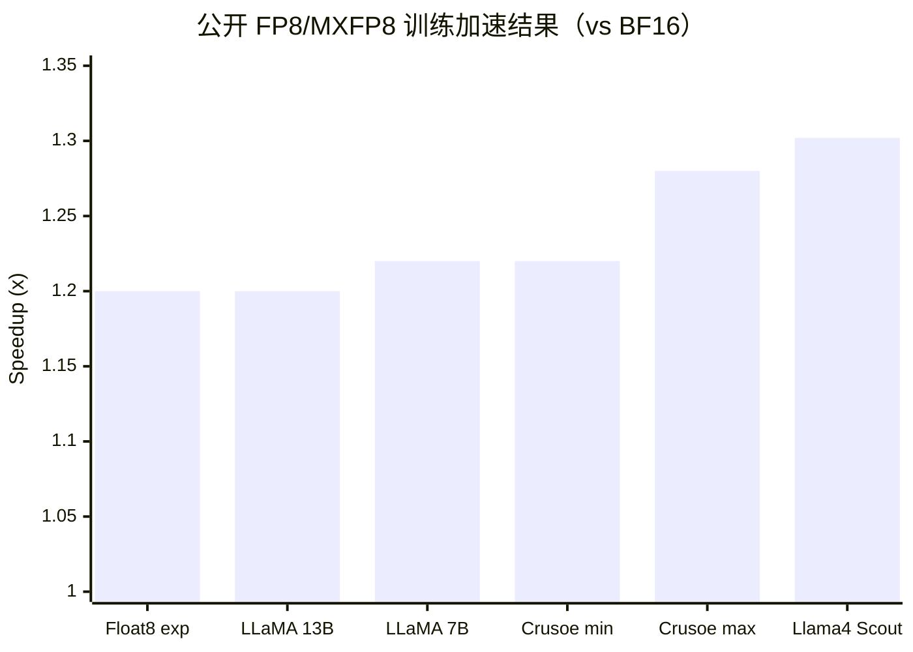

# 从 BF16 混合精度到 MXFP8：讲述大纲

面向对象：算法同事和训练框架同事。默认听众熟悉 FP16/BF16 混合精度训练，但不了解 FP8 / MXFP8。

建议时长：45-70 分钟。45 分钟版本讲主线，70 分钟版本展开 TE / MindSpeed 实现、通信和风险边界。

---

## 0. 开场：这不是新的 dtype，而是一套低精运行时

建议时长：6-8 分钟

核心目标：

- 先说明这次不是介绍一个新的 dtype，而是介绍一套低精度训练执行链。
- 明确听众已经熟悉 BF16 mixed precision，所以不会重复讲 AMP 基础。
- 明确主线：从 FP8 的 scale 机制讲到 MXFP8，再讲 TE 与 MindSpeed 如何把它落到训练框架。

建议讲法：

```text
大家已经熟悉 BF16 混合精度训练：大部分计算用 BF16，部分状态和关键路径保留高精度。

FP8/MXFP8 继续降低计算和访存成本，但它不能简单理解成“把 BF16 换成 FP8 dtype”。
它的核心是一套运行时机制：在模块内部管理量化数据和 scale 的生命周期，并把低精 GEMM、缓存复用和必要通信组织成可训练的执行闭环。
```

本场要回答的三个问题：

1. FP8 训练为什么不能只是换 dtype？
2. MXFP8 相比普通 FP8 改进在哪里？
3. TE / MindSpeed 在框架里怎么实现这条路径？

### 0.1 为什么值得关注：收益来自核心 GEMM 主路径

开场可以先给动机，但不要一开始陷入 benchmark 细节。

建议讲法：

```text
FP8/MXFP8 的收益不是来自“模型整体变成 8bit”，而是来自把 forward、dgrad、wgrad 等核心 GEMM 主路径降到低精度执行。

收益主要来自两点：
1. 低精 GEMM 吞吐更高；
2. activation / weight / gradient 参与 GEMM 时位宽更低，关键路径带宽压力下降。
```

同时立刻给出收益边界：

```text
端到端收益不是理论 dtype 收益，而是：
低精 GEMM 吞吐和带宽收益 - 量化、scale、缓存维护、通信同步等额外开销。
```

### 0.2 公开结果：先用图建立直观预期

数据来自 `TE_FP8_MXFP8.md` 中整理的公开资料。需要明确说明：这些结果主要来自 `PyTorch / TorchAO / TorchTitan` 生态公开资料，可作为 FP8/MXFP8 训练收益旁证，不应说成 `Transformer Engine` 官方 benchmark。

建议先放这张图：



对应数据表：

| 公开场景 | 结果 | 用法 |
| --- | --- | --- |
| `Float8 in PyTorch [1/x]` / float8_experimental | up to `1.2x` | 作为小规模 float8 训练收益旁证 |
| `Float8 in PyTorch [1/x]` / LLaMA 13B / 8 GPUs | `1.20x` | 作为多卡 LLaMA 训练旁证 |
| `Float8 in PyTorch [1/x]` / LLaMA 7B / 1 GPU | `1.22x` | 作为单卡 LLaMA 训练旁证 |
| TorchAO + TorchTitan + MXFP8 / Crusoe B200 / Llama3-70B | `1.22x - 1.28x` | 说明 MXFP8 已经能转化为端到端训练收益 |
| TorchAO + TorchTitan + MXFP8 / Llama4 Scout / GB200 / MoE | `+30.2%`，约 `1.3x` | 说明 MXFP8 在 MoE 训练里也能得到稳定加速 |

讲述重点：

- 图的作用是建立量级预期：公开结果大多在 `1.2x - 1.3x` 区间。
- 不要承诺“用了 MXFP8 就一定 1.3x”。
- 后续机制部分要解释为什么收益会被量化、scale、缓存、通信等开销抵消。

---

## 1. 从 BF16 到 FP8：优化对象和表示方式

建议时长：8-12 分钟

### 1.1 引入 scale：FP8 比 BF16 更依赖缩放

听众已知点：

- 训练不是所有状态都用低精度。
- forward / backward 的主要矩阵计算可以低精度执行。
- optimizer state、master weight、部分 reduction 或累加仍可能保持高精度。

从 BF16 过渡到 FP8 时，先不要直接讲 GEMM 或实现，而是先解释为什么 FP8 不能像 BF16 那样主要依赖 dtype 直接替换。

可以先给一张数值范围对比表：

| 格式 | 指数 / 尾数直觉 | 近似可表示范围 | 讲述重点 |
| --- | --- | --- | --- |
| `BF16` | 8-bit exponent，7-bit fraction | 最大有限值约 `3.39e38` | 动态范围接近 FP32，因此很多计算可直接替换 dtype |
| `E4M3` | 4-bit exponent，3-bit mantissa | 约 `±448` | 精度相对更高，但动态范围明显更小，常用于 forward |
| `E5M2` | 5-bit exponent，2-bit mantissa | 约 `±57,344` | 动态范围更大，但有效精度更低，常用于 backward / gradient |

```text
BF16 之所以容易接入，是因为它的动态范围接近 FP32，很多地方可以直接替换计算 dtype。
从这组数据可见，单靠 FP8 编码很难直接承接训练中 input / activation、weight、gradient 的数值分布，因此必须引入新的机制：scale，把真实值按比例映射到 FP8 可表示范围内。
```

这里的逻辑是：

- FP8 格式只定义编码空间本身：指数位、尾数位、最大有限值和可表示间隔。
- scale 定义真实训练值到 FP8 编码空间之间的比例关系，使一批 tensor 值能以可控误差落入 FP8 编码范围。
- 训练中 activation、weight、gradient 的分布会不断变化，所以 scale 需要成为运行时状态，而不是静态常量。

建议收束：

> 单靠 FP8 编码难以直接承接训练中的数值分布；因此需要引入新的机制：scale，将真实值按比例映射到 FP8 可表示范围内。

### 1.2 FP8 表示：数据 + scale

关键概念：

```text
q = cast_to_fp8(x * scale)
```

需要强调：

- FP8 tensor 自身表达范围有限。
- 训练中真正进入低精路径的是量化后的数据和对应 scale / scale_inv。
- 只说 `E4M3` 或 `E5M2` 容易误解成 dtype 选择问题；更准确的理解对象是“量化数据 + scale”。

建议讲法：

```text
FP8 训练不是把 tensor 裸改成 FP8 dtype，而是把高精 tensor 映射成一组带缩放信息的量化表示。
```

引到下一节：

```text
理解了 FP8 的表示之后，再看这组表示主要被谁消费：低精 GEMM kernel。
```

### 1.3 FP8 数据消费：低精 GEMM 消费量化表示

理解了“量化数据 + scale”之后，再回到训练执行链里看它被谁消费。FP8 表示主要服务低精 GEMM kernel，而不是让所有算子都改成 FP8。

```text
高精 tensor
  -> 量化数据 + scale
  -> 低精 GEMM kernel
  -> 高精输出 / 后续状态更新
```

对 Transformer 模型来说，`Linear` / MLP / attention projection / MoE expert 中的大量计算最终都落在 GEMM 上。因此，本场后续固定使用 `Linear` 层作为贯穿例子：

```text
forward:   y  = x @ w^T
dgrad:     dx = dy @ w
wgrad:     dw = dy^T @ x
```

讲述重点：

- 这三条 GEMM 是 `Linear` 中最需要低精 kernel 消费量化表示的路径。
- 若 `x` 为 `[M, K]`，`w` 为 `[N, K]`，三条 GEMM 的计算量同阶，约为 `2MNK`。
- GEMM 输入侧可以是低精量化表示，但输出、loss、optimizer 等仍保持高精语义。

建议讲法：

```text
FP8 数据不是为了让所有算子都变成 FP8，而是为了让低精 GEMM kernel 能稳定消费“量化数据 + scale”这组表示。
```

---

## 2. 普通 FP8 和 DelayedScaling

建议时长：8-12 分钟

### 2.1 Linear 最小闭环：量化 -> GEMM -> scale 更新

以单层 `Linear` 为例：

```text
forward:
  x --量化--> x_fp8，记录 amax_x
  w --量化--> w_fp8，记录 amax_w
  y = GEMM(w_fp8, x_fp8)
  保存 backward 所需的量化缓存

forward 结束:
  汇总本层记录到的 amax
  更新下一轮使用的 scale

backward:
  dy --量化--> dy_fp8，记录 amax_dy
  dx = dy @ w
  dw = dy^T @ x

backward 结束:
  汇总 backward amax
  更新下一轮 backward scale
```

核心解释：

- 本轮量化通常使用已有 scale。
- 本轮记录新的 amax。
- scale 更新发生在 forward / backward 收尾，供下一轮使用。

一句话总结：

```text
DelayedScaling 的关键是：本轮用旧 scale，本轮记录新 amax，统一更新后给下一轮用。
```

### 2.2 DelayedScaling 状态：amax / scale / history

这一节不要进入并行通信，先把单层 FP8 训练的状态语义讲清楚。

建议按三个对象解释：

- `amax`：本轮实际看到的最大绝对值，用来观察当前 tensor 的数值范围。
- `scale`：下一次量化时使用的缩放因子，用来把输入映射进 FP8 可表示范围。
- `amax_history`：记录一段历史窗口，避免 scale 被单次异常值剧烈扰动。

建议讲法：

```text
amax 是观测值，scale 是下一次量化真正使用的控制量。
DelayedScaling 的名字强调的就是：本轮先观测 amax，scale 的变化延后到后续使用。
```

这样讲的好处：

- 先让算法同事理解 FP8 为什么需要动态标尺。
- 再让框架同事理解为什么 TE 需要维护 recipe state。
- 暂时不引入分布式同步，避免在 FP8 基础部分跳到并行实现细节。

### 2.3 普通 FP8 的局限：scale 粒度与状态成本

为 MXFP8 铺垫：

- per-tensor scale 粒度较粗。
- 同一个 tensor 内如果数值分布差异很大，小值可能损失明显。
- scale / amax 管理会引入额外运行时状态；在分布式场景下还可能引入同步成本。

过渡句：

```text
普通 FP8 的 scale 粒度越粗，就越依赖一个 scale 覆盖更宽的数值分布。MXFP8 的核心变化，就是把这个 scale 粒度进一步切细。
```

---

## 3. MXFP8：从 per-tensor scale 到 32 元素 block scale

建议时长：12-15 分钟

### 3.1 MXFP8 = FP8 data + E8M0 microscale

建议直接给定义：

```text
MXFP8 = FP8 data + E8M0 microscale
```

关键点：

- 每 `32` 个连续元素共享一个 scale。
- scale 使用 `E8M0`，可以理解为 power-of-two microscale。
- 这个 scale 是 block 级，不是整个 tensor 级。

对比普通 FP8：

```text
普通 FP8：一个 tensor 或较大范围共享 scale。
MXFP8：每 32 个连续元素共享一个 E8M0 scale。
```

### 3.2 块级 scale 的价值：误差、状态和约束

算法侧 takeaway：

- scale 粒度变细，每个 scale 覆盖的数值范围更窄。
- 对同一个 tensor 内分布不均的情况，量化误差更可控。
- MXFP8 可以更好地承接大模型训练中 activation / weight / gradient 的局部分布差异。

框架侧 takeaway：

- scale 粒度细化到 32 元素 block 级，scale 数量随 tensor size 增长。
- tensor 表示的复杂度来自 data 与 block scale 的强绑定关系。
- kernel、缓存和通信路径都必须维护 FP8 data 与对应 block scale 的配对关系。
- shape 和 shard 边界需要满足 block 对齐要求。

### 3.3 2D 矩阵中的 1D microscaling：rowwise / columnwise

这是重点页，建议画图。

先讲清楚：

- MXFP8 的 block 是一维的连续 `32` 元素。
- 对二维矩阵，不是一个二维 tile 共享一个 scale。
- 二维矩阵需要选择沿哪个方向划分 32 元素 block。

引出两个方向：

```text
rowwise:    沿行方向，每 32 个连续元素共享 scale
columnwise: 沿列方向，每 32 个连续元素共享 scale
```

必须强调：

```text
quantize(x).T != quantize(x.T)
```

原因：

- FP8 data 和 scale 是绑定的。
- 转置以后，连续 block 的方向变了。
- 不能只转置 data 而假设 scale 仍然正确。

建议讲法：

```text
MXFP8 的 rowwise / columnwise 不是同一份 FP8 buffer 的两个 stride 解释。
它们对应不同方向上的 32 元素 block，也就对应不同的 scale 分组。
```

### 3.4 MXFP8 相对 DelayedScaling 的关键差异

用一张表讲：

| 项目 | 普通 FP8 / DelayedScaling | MXFP8 |
| --- | --- | --- |
| scale 粒度 | tensor 级或较粗粒度 | 32 元素 block 级 |
| scale 来源 | 历史 amax 更新 | 当前 block 即时计算 |
| 状态 | 维护 scale / amax_history | 基本不维护 delayed scaling 状态 |
| 跨 rank amax 同步 | 可能需要 | 通常不需要 |
| 表示 | FP8 data + tensor scale | FP8 data + E8M0 block scale |
| 额外约束 | scale 同步和状态管理 | rowwise / columnwise、32 对齐、data+scale 通信 |

收束句：

```text
MXFP8 不是取消 scale，而是把 scale 从全局或 tensor 级状态，变成更细粒度的 block 级表示。
```

---

## 4. TE 低精度运行时

建议时长：10-15 分钟

### 4.1 用户入口：模块替换 + recipe + autocast

训练脚本层面：

```python
layer = te.Linear(hidden_size, hidden_size).cuda()
recipe = DelayedScaling(...)  # 或 MXFP8BlockScaling(...)

with te.autocast(enabled=True, recipe=recipe):
    y = layer(x)
    loss = loss_fn(y, target)

loss.backward()
optimizer.step()
```

讲述重点：

- 用户主要做三件事：替换模块、选择 recipe、设置 autocast 范围。
- 但 `autocast` 不是把后续所有 op 自动改成 FP8。
- 真正的量化和 GEMM 调度发生在 TE 模块内部。

### 4.2 TE 运行时抽象：recipe -> quantizer -> tensor -> GEMM

建议补充一张简单执行图，把抽象链和执行闭环放在一起：

```text
用户代码
  te.Linear + recipe + autocast
      |
      v
TE module forward / backward
      |
      +--> recipe state: scale / amax history / dtype
      +--> quantizer: 高精 tensor -> 量化表示
      v
quantized tensor
  FP8 data + scale
  rowwise / columnwise views
      |
      v
general_gemm()
      |
      v
GEMM kernel
      |
      v
高精输出 + amax 记录 / scale 更新 + backward 缓存
```

主链可以再压缩成：

```text
autocast
  -> FP8GlobalStateManager
  -> recipe
  -> recipe state
  -> quantizer
  -> quantized tensor
  -> general_gemm()
  -> tex.generic_gemm()
  -> scale / amax update
```

各层职责：

- `recipe`：定义 scaling 策略和 FP8 格式。
- `recipe state`：模块持有的运行时状态，例如 scale 和 amax history。
- `quantizer`：定义高精 tensor 如何变成量化表示。
- `quantized tensor`：保存 FP8 data、scale、rowwise / columnwise 视图。
- `GEMM kernel`：消费量化表示并输出高精结果。

建议讲法：

```text
TE 的价值不是提供一个 FP8 dtype，而是把 recipe、量化、缓存、GEMM、状态更新和通信组织成统一运行时。
```

### 4.3 Linear 三条 GEMM：视图选择和缓存复用

4.2 讲的是 TE 的通用运行时抽象：

```text
recipe state -> quantizer -> quantized tensor -> general_gemm() -> kernel
```

4.3 的作用是把这条抽象链落到一个具体模块：`te.Linear`。这里不再讨论 Linear 为什么是核心 GEMM，而是回答 TE runtime 在执行 Linear 时要做哪些运行时决策。

本节主线：

```text
Linear forward / backward 有三条 GEMM
  -> 每条 GEMM 消费的 tensor 方向不同
  -> quantizer 要生成匹配方向的量化视图
  -> quantized tensor 承载已生成的 data + scale，并暴露 row/col view
  -> backward 尽量复用 forward 缓存，减少重复量化
```

#### 4.3.1 从抽象链到 Linear runtime 决策

| 4.2 抽象 | Linear 中的具体决策 |
| --- | --- |
| `recipe state` | forward / backward 使用哪组 scale、amax history、FP8 format |
| `quantizer / usage` | `X`、`W`、`dY` 分别在什么时机量化，需要 rowwise、columnwise 还是双视图 |
| `quantized tensor` | 承载已经生成的 `data + scale` 表示，并保持 data、scale、view 与 GEMM/cache 的绑定关系 |
| `general_gemm()` | forward、dgrad、wgrad 分别消费哪两个量化视图 |
| cache / state update | 哪些 forward 量化结果保留给 backward，哪些 amax / scale 在收尾更新 |

这一页建议讲成四个问题：

```text
1. 当前 tensor 是否需要量化？
2. 需要 rowwise、columnwise，还是两种视图都要？
3. 当前 GEMM 消费哪两个量化视图？
4. 这些视图是否要缓存给 backward 复用？
```

#### 4.3.2 Linear 的 forward / backward 执行顺序

继续用同一个 Linear 例子：

```text
forward: y  = x @ w^T
dgrad:   dx = dy @ w
wgrad:   dw = dy^T @ x
```

TE 的调用视角：

```text
forward: general_gemm(w, x,  layout="TN")
dgrad:   general_gemm(w, dy, layout="NN")
wgrad:   general_gemm(x, dy, layout="NT")
```

运行时执行关系：

```text
forward:
  X, W
    -> quantizer 根据 usage 生成 X_q / W_q
    -> general_gemm(w, x, layout="TN")
    -> Y
    -> 保留 backward 可能复用的 X_q / W_q 视图

backward:
  dY
    -> quantizer 根据 dgrad / wgrad 需求生成 dY_q

  dgrad:
    dY_q + W_q
      -> general_gemm(w, dy, layout="NN")
      -> dX

  wgrad:
    dY_q + X_q
      -> general_gemm(x, dy, layout="NT")
      -> dW
```

#### 4.3.3 MXFP8 下为什么 view 选择更关键

普通 FP8 中，视图问题更多体现为转置缓存和 scale 状态管理。MXFP8 中，rowwise / columnwise 对应不同方向的 32 元素 block，也就是不同的 `data + scale` 配对关系。

TE 原生 MXFP8 视角下，可以这样讲数据消费关系：

| GEMM | 数学形式 | TE 调用 | 需要的 MXFP8 表示 |
| --- | --- | --- | --- |
| forward | `y = x @ w^T` | `general_gemm(w, x, layout="TN")` | `X rowwise + W rowwise` |
| dgrad | `dx = dy @ w` | `general_gemm(w, dy, layout="NN")` | `W columnwise + dY rowwise` |
| wgrad | `dw = dy^T @ x` | `general_gemm(x, dy, layout="NT")` | `X columnwise + dY columnwise` |

这里的重点是：

- rowwise / columnwise 不是一份 FP8 data 的两个标签，而是两套方向不同的 `data + scale`。
- forward 如果提前保留了 backward 需要的视图，backward 可以直接复用缓存。
- 如果缓存缺失，或已有视图方向不匹配，runtime 需要重新量化或准备另一种表示。
- transpose flag 只能改变 GEMM 的访问布局，不能重新生成正确方向的 MXFP8 block scale。

建议收束：

```text
4.3 要说明的是：TE runtime 管理 quantizer、quantized tensor、row/col views 和 backward cache，是为了让 Linear 的 forward、dgrad、wgrad 三条 GEMM 都能拿到匹配方向的量化表示，并尽量减少重复量化成本。
```

### 4.4 并行通信边界：amax 同步、低精 all-gather 和高精归约

不要展开所有并行表，主讲保留五个结论：

1. 普通 FP8 的并行同步重点是 amax / scale。
2. 是否同步 amax 不由“有没有通信”决定，而由“多个 rank 的分片是否会作为同一个逻辑 tensor 进入低精 kernel”决定。
3. MXFP8 没有 delayed scaling 式的全局 amax 同步。
4. MXFP8 低精通信主要集中在 all-gather 类路径，通信对象是 `data + scale`。
5. GEMM 后的 reduce-scatter / all-reduce 通常处理的是高精输出，不应简单说成“MXFP8 通信全链路低精”。

建议讲法：

```text
MXFP8 不是没有通信，而是少了 amax 同步这一类通信。数据并行、张量并行、序列并行本身的数据交换仍然存在。
```

---

## 5. MindSpeed/NPU 实现：复用接口协议，替换运行时

建议时长：10-15 分钟

### 5.1 接管策略与路径对比：保留接口约定，重写执行路径

```text
MindSpeed 保留 TE 的接口约定和 import 路径，但不依赖 TE 的 CUDA 后端；它用 Python patch 接管 TE 入口，再把量化、GEMM 和通算融合落到 torch_npu / CANN 算子。
```

建议把接管策略和路径对比放在同一节讲，避免先讲一句“替换运行时”，下一节又重复解释路径差异。

接管粒度：

| TE 入口 | MindSpeed/NPU 承接 |
| --- | --- |
| `transformer_engine.pytorch.fp8_autocast` | MindSpeed `fp8_autocast` |
| `transformer_engine.common.recipe.MXFP8BlockScaling` | MindSpeed recipe |
| TE Linear 调用链 | MindSpeed TEColumn / TERow Parallel Linear |
| TE CUDA kernel / cuBLAS MXFP8 GEMM | torch_npu / CANN 算子 |

路径对比：

```text
TE 原生：
用户代码
  -> TE Python runtime
  -> C++ binding
  -> CUDA kernel / cuBLAS MXFP8 GEMM

MindSpeed：
用户代码
  -> transformer_engine.* import 路径被 patch
  -> MindSpeed Python runtime
  -> torch_npu 算子
  -> CANN / NPU 执行
```

讲述重点：

- MindSpeed 不是调用 TE CUDA kernel。
- TE 未安装时可以创建 dummy module 作为挂载点。
- TE 已安装时，相关类和函数会被 MindSpeed 实现替换。
- 对框架同事来说，关键判断是：TE import path 是接口兼容层，实际执行路径已经换成 MindSpeed Python runtime + torch_npu / CANN。

### 5.2 抽象重写：简化 RecipeState 和 Quantizer 层级

这一节要讲具体，不要只说“替换运行时”。建议按“TE 原生抽象链”和“MindSpeed/NPU 抽象链”对照：

```text
TE 原生：
MXFP8BlockScaling
  -> MXFP8BlockScalingRecipeState
  -> MXFP8Quantizer.set_usage(rowwise / columnwise)
  -> MXFP8Tensor(rowwise_data / columnwise_data + scale_inv)
  -> tex.quantize() / general_gemm() / tex.generic_gemm()

MindSpeed/NPU：
transformer_engine.* import path 被 patch
  -> MXFP8ScalingRecipe.quantization(colwise, rowwise)
  -> torch_npu.npu_dynamic_mx_quant[_with_dual_axis]()
  -> Float8Tensor2D(row_tensor / col_tensor = data + scale)
  -> torch_npu.npu_quant_matmul(group_sizes=[1, 1, 32])
```

对照表：

| TE 原生 | MindSpeed |
| --- | --- |
| `RecipeState` | 简化为 `FP8Metadata` / recipe 懒初始化 |
| `MXFP8Quantizer` 独立对象 | 无独立 Quantizer，`colwise` / `rowwise` 作为 `quantization()` 入参 |
| `set_usage(rowwise, columnwise)` | 由调用点直接决定生成 row / col 哪些表示 |
| `MXFP8Tensor` 管理 rowwise / columnwise storage | `Float8Tensor2D` 保存 `row_tensor` / `col_tensor`，每个都是 `data + scale` |
| Python 层显式处理部分 padding / usage 语义 | padding、双轴量化等更多下沉到 `torch_npu` / CANN 算子 |
| `tex.quantize` / `tex.generic_gemm` / cuBLAS | `npu_dynamic_mx_quant*` / `npu_quant_matmul` |

讲述重点：

- MindSpeed 不是把 TE 的 `Quantizer`、`RecipeState` 和 CUDA kernel 原样搬到 NPU。
- 它复用的是 TE 的接口协议和调用入口，内部把抽象层压平：recipe 直接调用 NPU 量化算子，tensor 只保存 NPU 算子产出的 row / col 表示，GEMM 直接消费这些表示。
- 对框架同事来说，关键变化是职责迁移：TE 里由 Python runtime + C++/CUDA 分层承担的工作，在 MindSpeed 中更多变成 Python 控制 + torch_npu 算子契约。

建议讲法：

```text
MindSpeed 复用的是 TE 的入口协议，不是 TE 的内部实现。RecipeState / Quantizer / MXFP8Tensor / GEMM 这条链在 NPU 上被重新拆分：上层保留 recipe 和调用约定，下层交给 torch_npu 算子生成 data + scale 并执行 quant matmul。
```

### 5.3 Tensor 表示与职责迁移：row_tensor / col_tensor

这一节承接 5.2，把抽象重写落到 tensor 表示上。

TE 原生 `MXFP8Tensor`：

```text
rowwise_data + rowwise_scale_inv
columnwise_data + columnwise_scale_inv
_quantizer 引用
部分 padding / usage 语义由 TE runtime 显式管理
```

MindSpeed/NPU `Float8Tensor2D` 风格表示：

```text
row_tensor = data + scale
col_tensor = data + scale
origin_shape / dtype / key
padding、双轴量化、部分 layout 约束更多下沉到 torch_npu / CANN
```

讲述重点：

- TE 侧 tensor 更像“带 Quantizer 语义的 runtime 对象”。
- MindSpeed 侧 tensor 更像“保存 NPU 量化算子产物的轻量容器”。
- 后续 GEMM 不是重新推导 scale，而是按 row / col 方向取出对应 `data + scale`，传入 `npu_quant_matmul`。

### 5.4 torch_npu 算子映射：量化与 GEMM

只讲量化和 GEMM 两类；通算融合统一放到 5.5。

量化：

```text
npu_dynamic_mx_quant
npu_dynamic_mx_quant_with_dual_axis
```

GEMM：

```text
npu_quant_matmul
npu_add_quant_matmul_
```

解释：

- `npu_dynamic_mx_quant_with_dual_axis` 可以一次产出 rowwise 和 columnwise 所需表示。
- `npu_quant_matmul` 消费 FP8 data + E8M0 scale，输出通常仍是 BF16 等高精 dtype。
- `npu_add_quant_matmul_` 用于 GEMM 后原地累加到高精 main_grad。

强调：

```text
不存在“FP8 梯度累加”。FP8/MXFP8 是 GEMM 输入侧低精，累加和输出语义仍然是高精。
```

### 5.5 DefaultOps / MC2：通信分离与通算融合

不要一开始就讲 MC2，先讲默认路径：

```text
DefaultOps:
  HP all-gather -> 量化 -> FP8 GEMM
  FP8 GEMM -> HP reduce-scatter
```

再讲 MC2：

```text
MC2:
  all-gather + quant matmul 融合
  matmul + reduce-scatter 融合
```

关键边界：

- DefaultOps 通信和计算分离，通信通常还是 BF16。
- MC2 all-gather 路径可以直接通信 MXFP8 data + scale，并和 GEMM 融合。
- reduce-scatter 侧通常处理 GEMM 高精输出。
- MindSpeed 中 MC2 只支持 MXFP8 recipe。

---

## 6. 约束、风险和收益边界

建议时长：5-8 分钟

### 6.1 算法侧：稳定性、格式和层选择

需要关注：

- 哪些层适合 FP8 / MXFP8。
- loss 曲线和收敛是否稳定。
- activation / weight / gradient 的 outlier 分布。
- E4M3 / E5M2 / HYBRID 配置选择。
- per-tensor 与 per-block scale 对精度的影响。

建议提醒：

```text
MXFP8 改善的是表示粒度和局部动态范围适配，不等于所有模型和所有层都天然稳定。
```

### 6.2 框架侧：shape、缓存、通信和 fallback

需要关注：

- 模块替换和 autocast 范围。
- recipe 与 quantizer / tensor 表示。
- shape 是否满足 32 对齐。
- rowwise / columnwise 缓存生命周期。
- 通信路径是否传高精 tensor，还是传 `data + scale`。
- fallback 行为是否明确。
- NPU 算子能力和版本约束。

建议提醒：

```text
MXFP8 的工程难点不是单个量化公式，而是 shape、缓存、GEMM layout、通信和 fallback 是否在完整训练链路里闭合。
```

### 6.3 收益边界

建议措辞：

- 可以说“收益主要来自核心 GEMM 主路径吞吐和带宽下降”。
- 不要说“训练一定提升 2x”。
- 公开端到端结果可作为生态旁证，但要区分 TE 官方 benchmark 和 PyTorch / TorchAO / TorchTitan 生态结果。

---

## 7. 总结：三句话回到主线

建议时长：2-3 分钟

三句话：

```text
第一，FP8 不是全局 dtype 切换，而是模块内的低精度执行链。

第二，MXFP8 的核心是 32 元素 microscaling，把 scale 粒度从 tensor 级细化到 block 级。

第三，工程实现的关键是把量化、scale、GEMM、缓存复用和通信组织成稳定闭环。
```

最后可以回到开场三个问题：

1. FP8 为什么不能只是换 dtype？
   - 因为 FP8 必须依赖 scale 和专用 kernel 才能稳定训练。

2. MXFP8 改进在哪里？
   - 把 scale 细化到 32 元素 block，降低量化误差，并减少 delayed scaling 式 amax 同步。

3. TE / MindSpeed 怎么实现？
   - TE 用 recipe / quantizer / quantized tensor / GEMM runtime 闭环实现；MindSpeed 保留 TE 接口约定，用 torch_npu 算子重写底层执行。

---

## 8. 备讲材料：45 分钟和 70 分钟版本取舍

### 45 分钟版本

建议删减：

- MindSpeed 算子清单只讲 3 类，不展开每个算子。
- 通信只讲 DefaultOps / MC2 的边界，不展开多并行策略。
- TE 源码路径只作为备查，不在主讲里逐文件解释。

时间分配：

| 部分 | 时间 |
| --- | --- |
| 开场与收益主线 | 5 分钟 |
| FP8 基础与 scale | 12 分钟 |
| MXFP8 原理 | 12 分钟 |
| TE 实现链路 | 8 分钟 |
| MindSpeed 实现 | 5 分钟 |
| 约束和 Q&A | 3 分钟 |

### 70 分钟版本

可以展开：

- DelayedScaling 的 amax / scale 更新时机。
- rowwise / columnwise 与 backward dgrad / wgrad 的对应关系。
- MXFP8 all-gather 低精通信和 GEMM 后高精归约的区别。
- MindSpeed DefaultOps / MC2 / MoE grouped matmul / grad accumulation fusion。

时间分配：

| 部分 | 时间 |
| --- | --- |
| 开场与收益主线 | 5 分钟 |
| FP8 基础与 delayed scaling | 15 分钟 |
| MXFP8 原理与 rowwise / columnwise | 15 分钟 |
| TE 执行链 | 15 分钟 |
| MindSpeed NPU 实现 | 12 分钟 |
| 约束、风险、Q&A | 8 分钟 |

---

## 9. 备讲材料：预期问题与建议回答

### Q1：FP8 梯度是不是也用 FP8 累加？

不是。FP8 / MXFP8 主要是 GEMM 输入侧低精，硬件内部通常高精累加，输出和梯度累加仍保持高精语义，例如 BF16 输出或 FP32 main_grad。

### Q2：MXFP8 是否完全不需要通信？

不是。MXFP8 不需要 delayed scaling 那类跨 rank amax 同步，但 tensor parallel、sequence parallel、data parallel 的数据通信仍然存在。

### Q3：MXFP8 通信是不是全链路低精？

不是。低精通信主要集中在 all-gather 类路径，通信对象是 `FP8 data + E8M0 scale`。GEMM 后的 reduce-scatter / all-reduce 通常处理高精输出。

### Q4：为什么 rowwise / columnwise 不能只靠 transpose 解决？

因为 scale 绑定的是 32 元素连续 block。转置会改变连续 block 的方向，`quantize(x).T` 和 `quantize(x.T)` 的 scale 分组不同，所以不能只转置 data 后复用原 scale。

### Q5：MindSpeed 是否依赖 Transformer Engine CUDA 后端？

不依赖。MindSpeed 复用 TE 的 import 路径和接口约定作为挂载点，但底层量化、GEMM 和通算融合由 torch_npu / CANN 算子提供。

### Q6：MXFP8 的主要落地风险是什么？

主要是四类：

- 数值稳定性和收敛验证。
- shape / shard 是否满足 32 对齐。
- rowwise / columnwise 缓存和 fallback 是否正确。
- 通算融合路径与普通路径的语义是否一致。
